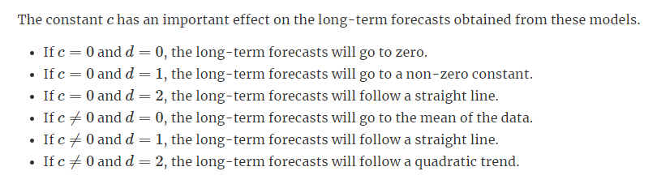

```{r setup, include=FALSE}
knitr::opts_chunk$set(echo = TRUE)
```

## Libraries
```{r, warning=FALSE, message=FALSE}
library(readr)
library(tsibble)
library(dplyr)
library(tidyr)
library(ggplot2)
library(fable)
library(feasts)
library(urca)
library(gridExtra)
library(lubridate)
```

## Reading in data
```{r}
drinks = read_csv('../../Data/Drinks.csv')
drinks = drinks[,-3]
drinks = drinks[,-2]

drinks = drinks %>% filter(Date > "2004-12-31")

# Turns all of it into a tsibble
ts = drinks %>% 
  mutate(index = as_date(Date)) %>%
  select(-Date) %>%
  as_tsibble(index = index)
ts
```

## Time-plot
```{r}
plot1 = ts %>% autoplot(MNST) + xlab("MNST")
plot2 = ts %>% autoplot(SBUX) + xlab("SBUX")
grid.arrange(plot1, plot2, nrow=3)

df1 = data.frame(time = ts$index, M = ts$SBUX, isin = "SBUX")
df2 = data.frame(time = ts$index, M = ts$MNST, isin = "MNST")
df = rbind(df1, df2)
ggplot(df, aes(x = time, y = M, color = isin)) + geom_line() + ggtitle("ts")
```

\pagebreak

## Univariate of MNST
```{r}
mnst = ts[,-1]
```

## Seasonal Plot
```{r}
mnst %>% gg_season(MNST, polar = T) +
  ggtitle("Seasonal plot: MNST") + ylab("Adj Close")
```

\pagebreak

## Differencing

$w_t = \begin{cases} log(y_t) & \lambda = 0 \\ \frac{y_t^\lambda - 1}{\lambda} & \lambda \neq 0 \end{cases}$

## Taking a BoxCox Transformation
```{r}
lam = 0.3

mnst %>%
  mutate(box_cox(MNST, lam)) %>%
  gather() %>%
  ggplot(aes(x = index, y = value)) +
  geom_line() +
  facet_grid(key ~ ., scales = "free_y") +
  xlab("Year") + ylab("") +
  ggtitle("ADJ Closing Price for MNST")
```

```{r}
mnst %>%
  mutate(difference(box_cox(MNST, lam))) %>%
  gather() %>%
  ggplot(aes(x = index, y = value)) +
  geom_line() +
  facet_grid(key ~ ., scales = "free_y") +
  xlab("Year") + ylab("") +
  ggtitle("ADJ Closing Price for MNST")

mnst_trans = mnst
mnst_trans$MNST = difference(box_cox(mnst_trans$MNST, lam))
mnst_trans = drop_na(mnst_trans)
```

```{r}
mnst_trans %>% gg_season(MNST, polar = T) +
  ggtitle("Seasonal plot: MNST") + ylab("Adj Close")
```

## Choosing a model
```{r}
plot1 = mnst_trans %>% ACF(MNST) %>% autoplot()
plot2 = mnst_trans %>% PACF(MNST) %>% autoplot()
grid.arrange(plot1, plot2, ncol=2)
```

\pagebreak

## Fitting the model

When fitting the original model, $ARIMA(1, 1, 1)$.

```{r}
fit = mnst %>% model(ARIMA(box_cox(MNST, lam) ~ 1 + pdq(1, 1, 1) + PDQ(0, 0, 0)))
report(fit)
```

## Checking residuals
```{r}
fit %>% gg_tsresiduals()
augment(fit) %>% features(.resid, ljung_box, lag = 12, dof = 4)
```

## Forecasting
```{r}
fc = fit %>% forecast()

fc %>%
autoplot() +
  ylab("Adj Close") + xlab("Year")
accuracy(fit)
```



